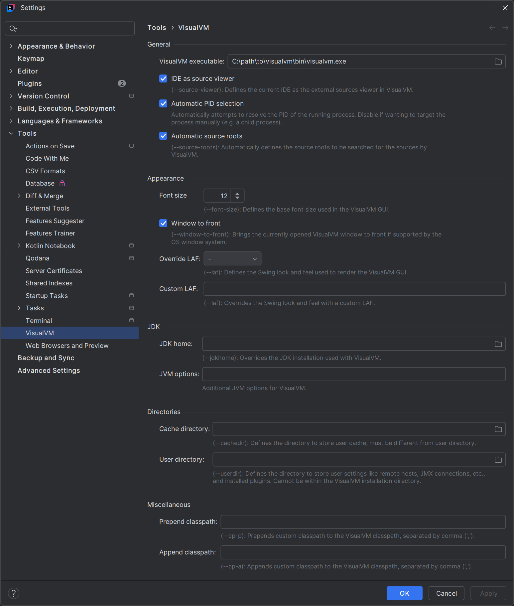
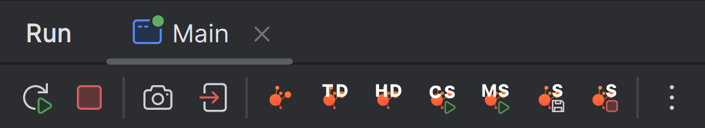

# VisualVM Integration

## Settings

The plugin settings can be found in the `File` > `Settings` dialog under the `Tools` section.
**The path to the VisualVM executable is required.** The other options are optional. See
the [VisualVM Command Line Options](https://visualvm.github.io/docs/command-line-options.html) for more information.

## Usage

The integration plugin offers a `Tools` > `VisualVM` menu item that can be used to launch VisualVM.

When an application is running, the `Run` menu bar offers the following VisualVM actions:

- Attach
    - Attaching to the running process, i.e. opening the process view in VisualVM
- Thread Dump
    - Takes a thread dump and opens it in VisualVM
- Heap Dump
    - Takes a heap dump and opens it in VisualVM
- Start CPU Sampler
    - Starts CPU sampling
- Start Memory Sampler
    - Starts memory sampling
- Sampler Snapshot
    - Takes a sampler snapshot and opens it in VisualVM
- Stop Sampler
    - Stops sampling

The actions may also be manually added to e.g. debugger menu bar, if so desired.
The only requirement is that the PID (process ID) is resolvable from the context.
